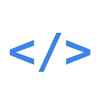

  
  <h1>CodeDash</h1>
  

    <strong>一个极简、美观的代码打字练习网页</strong>
  

  
  

---

## 📖 简介

**CodeDash** 是专为开发者设计的打字练习工具。与普通打字练习不同，它让你直接练习真实的编程语法、常用算法和逻辑代码。

界面设计现代简洁，支持 **暗黑模式** 和 **中英双语** 切换，让你在沉浸式环境中提升代码输入速度。

## ✨ 功能特点

- **🎯 多种练习模式**：
  - **关键词**：练习各类语言的保留字。
  - **代码片段**：练习常用的简短逻辑。
  - **完整代码**：挑战 *快速排序*、*二分查找* 等经典算法。
  - **自定义**：粘贴你自己的代码进行针对性练习。
  
- **👨‍💻 支持多种语言**： 
  - 内置 **Python, Java, C, C++, JavaScript, TypeScript, Go, SQL** 等常见语言库。
  
- **🎨 极致体验**：
  - **实时统计**：实时显示 WPM (每分钟字数) 和准确率。
  - **智能辅助**：自动处理代码缩进，打字手感极佳。
  - **双语界面**：完美支持简体中文和英文。

---

  Made by <a href="https://juniexd.cn/">JunieXD</a>

